<div align="center">

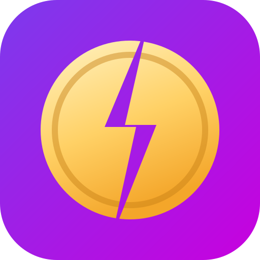

# Split Now

### Spending is wise, splitting is free. Split Now!

**Split bills, not friendships.** A free, open-source expense-splitting app for friends, flatmates and trips:<br />
bill scanning, live table splits, UPI-first settle-ups and optional AI.

[](https://split-now.web.app)
[](LICENSE)
[](#install-it)
[](https://buymeacoffee.com/amritdash)
[](https://github.com/sponsors/amrit-dash)


-1f2937?logo=googlegemini&logoColor=8e75ff)

<br />

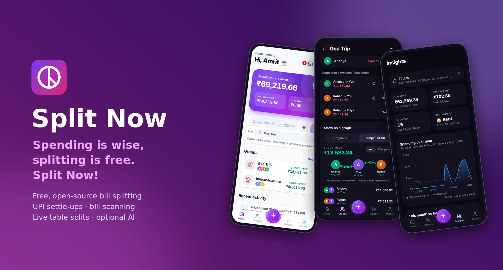

</div>

---

## See it move

<table>
<tr>
<td width="320" align="center"></td>
<td>

**The balance card breathes.** Soft light and dark patches drift across it, and the settle icon signs a cheque in your currency.

**Settle-up graph.** You sit in the middle. Money flows in green and out in red, with thicker lines for bigger amounts. Switch between Simplified and Original to see the extra payments that simplifying removes.

**Everything respects reduced motion.** With it turned on, you get the same screens, still.

[**Open the live demo →**](https://split-now.web.app) (pick a name, no account needed)

</td>
</tr>
</table>

## Screens

<table>
<tr>
<td align="center">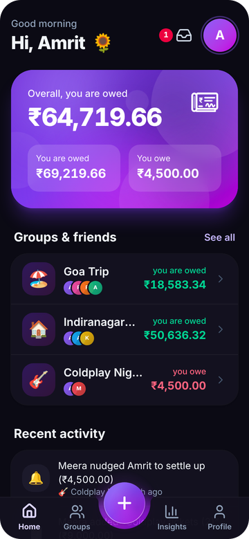<br /><sub><b>Home</b>: balance card, groups and friends, recent activity</sub></td>
<td align="center">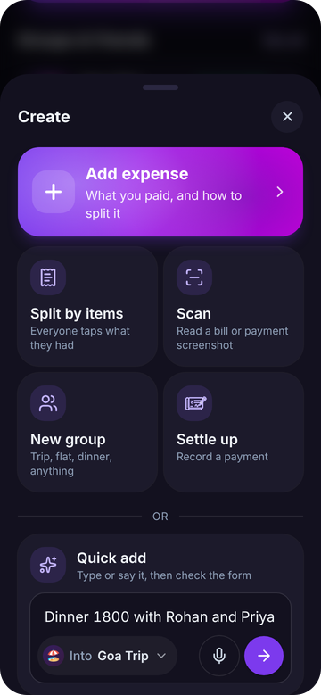<br /><sub><b>Create</b>: Quick add, Split by items, Scan, new group</sub></td>
<td align="center">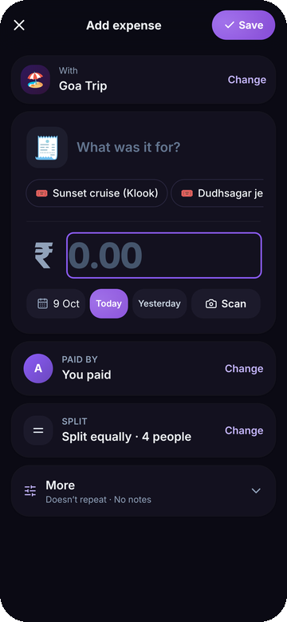<br /><sub><b>Add expense</b>: every split type, scan a receipt</sub></td>
</tr>
<tr>
<td align="center">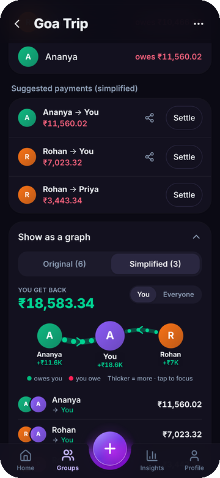<br /><sub><b>Group</b>: who pays whom, simplified</sub></td>
<td align="center">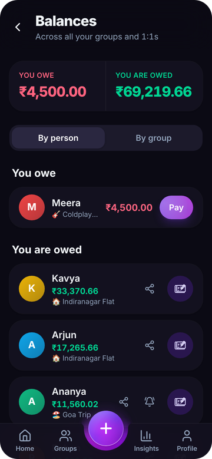<br /><sub><b>Balances</b>: by person or by group, with Remind and Nudge</sub></td>
<td align="center">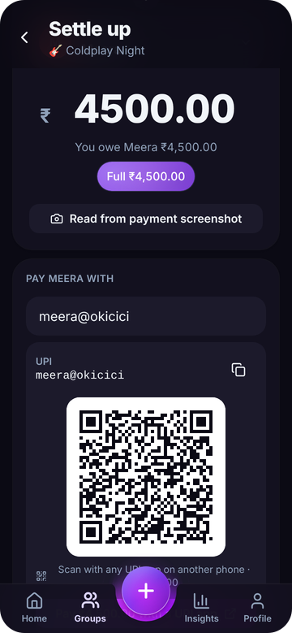<br /><sub><b>Settle up</b>: a UPI QR code for the exact amount</sub></td>
</tr>
<tr>
<td align="center">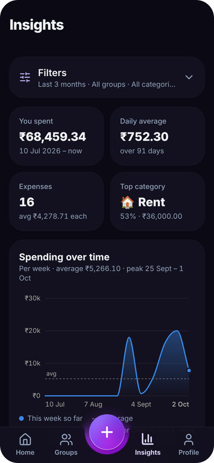<br /><sub><b>Insights</b>: animated charts and filters</sub></td>
<td align="center">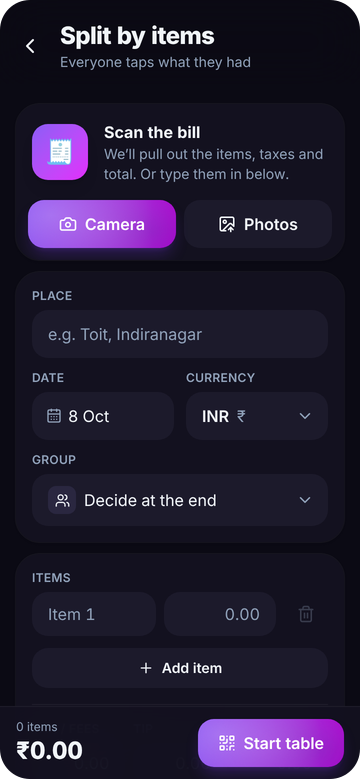<br /><sub><b>Split by items</b>: a live table, no sign-up</sub></td>
<td align="center">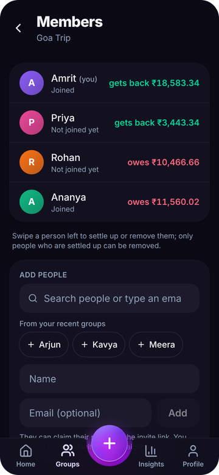<br /><sub><b>Members</b>: add people, settle up or remove</sub></td>
</tr>
<tr>
<td align="center">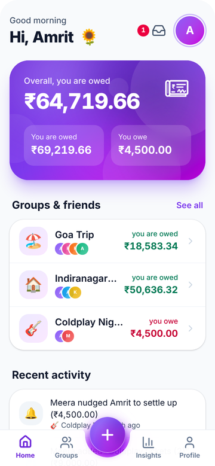<br /><sub>Light mode</sub></td>
<td align="center">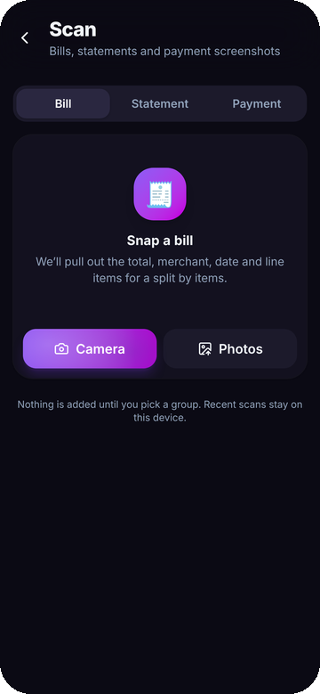<br /><sub><b>Scan</b>: bills, statements, payments</sub></td>
<td align="center">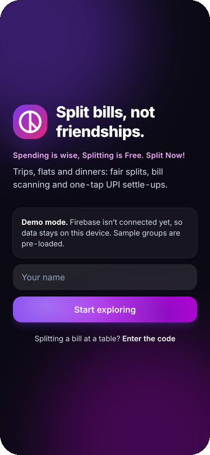<br /><sub><b>Sign in</b>, or try the demo</sub></td>
</tr>
</table>

## Features

| | |
|---|---|
| 👥 **Groups, 1:1s and a personal wallet** | Trips, homes, couples, events. Add people before they sign up; they claim their place by invite link or code. Photos and names follow each person's own profile once linked. Leave, archive or remove members. |
| ➗ **Every kind of split** | Equally, exact amounts, percentages, shares, equal + adjustments, and by item. Several payers per expense. Rounding always adds up. Recurring expenses. |
| ⚡ **Quick add** | Type or say "dinner 1200 with Rohan" and the form opens filled in. Nothing is saved until you check it. |
| 🍽️ **Split by items, live** | Scan the bill at the table and show a QR code. Everyone opens it on their own phone, with no account needed, and taps what they had. Shared items split by portions, and everyone sees their total with tax and tip. Finish into an existing group or a new one. |
| 📷 **Smart scan** | Bills, payment screenshots (GPay, PhonePe, Paytm, BHIM) and statement screenshots, with many transactions at once flagged by trip dates. Reading is on the device by default, or by Gemini when AI is on. The last 10 scans are kept, and re-scanning the same bill is spotted. |
| 🤖 **AI features (optional)** | Gemini reads bills into items, taxes and a total, statements into transactions, and bank SMS the built-in parser can't. Use your own free key, the project key (admin-controlled), or no AI at all. [docs/AI.md](docs/AI.md) |
| 💬 **Auto-capture** | Bank and UPI debit SMS, Apple Pay taps and the share sheet land in an **Inbox** that asks whether each payment was shared. Nothing is added without your OK. [docs/AUTO_CAPTURE.md](docs/AUTO_CAPTURE.md) |
| 💸 **Balances and settling up** | Balances by person (net across groups) or by group. Settle one person across several groups with one payment. UPI QR codes for the exact amount and app links. Remind and Nudge with a pay-me link. |
| 🧮 **Simplified debts, visualised** | Per-group simplification and an animated flow graph, with the exact list underneath. |
| 💱 **Multi-currency** | Any currency per expense, converted at the day's ECB rate and locked to the expense. |
| 📊 **Insights** | Spending over time, this month vs last, categories, groups, paid vs share, biggest expenses, with collapsible filters. Budget alerts. |
| 🔁 **Switch from Splitwise** | Import a Splitwise CSV export, check balances against Splitwise's totals, map people, import. |
| 🛡️ **Admin console** | For the project owner: feature flags, maintenance mode, a minimum app version, announcements, limits, stats, user blocking and AI settings. |
| 📱 **PWA** | Install prompts (guided on iOS), offline app shell, update banner, push notifications, light/dark themes and accent colours. |

## Install it

Open [split-now.web.app](https://split-now.web.app) (also served at [freesplit.web.app](https://freesplit.web.app)):

- **Android / desktop Chrome**: tap **Install** in the banner.
- **iPhone**: Share → **Add to Home Screen** (the app shows you how).

## Run it yourself

```bash
git clone https://github.com/amrit-dash/split-now.git
cd split-now
npm install
npm run dev            # http://localhost:5173, demo mode (no Firebase needed)
```

Demo mode keeps data in your browser and pre-loads sample groups (a Goa trip, a Bengaluru flat). To connect your own Firebase project, follow **[docs/FIREBASE_SETUP.md](docs/FIREBASE_SETUP.md)**, then optionally **[docs/AI.md](docs/AI.md)** and **[docs/AUTO_CAPTURE.md](docs/AUTO_CAPTURE.md)**.

> Production builds read the Firebase web config from `.env.production`, which is gitignored: copy `.env.production.example` and fill in your own project's values. `.firebaserc` points at the maintainer's project (`split-it-prod`); a fork should replace it with its own before deploying.

### Scripts

| Command | What it does |
|---|---|
| `npm run dev` | Vite dev server |
| `npm run build` | Typecheck + production build (with service worker) |
| `npm run check` | Biome lint + format check |
| `npm run typecheck:all` | App, tooling and Cloud Functions typecheck |
| `npm test` | Unit tests (Vitest) |
| `npm run test:rules` | Firestore + Storage security-rule tests in the emulator (Java 21) |
| `npm run test:functions` | Cloud Functions tests in the emulators |
| `npm run test:e2e` | Playwright smoke tests (demo mode) |
| `npm run test:all` | Everything CI runs |
| `npm run readme:media` | Regenerate the README screenshots, banner, animated demo and link previews from the demo app |
| `npm run deploy` | Build and `firebase deploy` (also `deploy:hosting`, `deploy:functions`, `deploy:rules`) |

### Project layout

```
src/
  lib/          pure logic: money, splits, balances, simplify, parsing, insights, settle allocation (unit-tested)
  data/         Repo interface + Firebase and in-browser (demo) implementations
  hooks/        auth, shared live-data store, AI status, receipt reader, OCR
  components/   UI: sheets, toasts, tab bar, charts, graph, animated icons
  pages/        screens (Home, GroupDetail, ExpenseForm, SettleAll, SettleUp, Scan, SplitBill, Table, Insights, Inbox, Profile, Admin, …)
shared/         code shared by the app and Cloud Functions (SMS parser, capture filters, AI config, budgets)
functions/      Cloud Functions (asia-south1): AI reading, SMS capture webhook, push, reminders, FX rates
tests/          Firestore / Storage rules tests;  e2e/ Playwright
docs/           setup guides, product plan, roadmap and the October 2026 audit
```

## How it works

- **Money** is stored as integer minor units (paise for INR). Splits use largest-remainder rounding, so shares always add up to the total.
- **Balances are computed on the device** from each group's expenses and payments. Cloud Functions handle only what needs a server: AI calls, the SMS webhook, push notifications, reminders and shared exchange rates.
- **Security** lives in `firestore.rules` and `storage.rules`, with emulator tests. AI keys are encrypted on the server and never sent back to the app.
- **Fast first paint**: lazy routes, a shared Firestore listener store, self-hosted fonts and hand-rolled SVG charts.

More detail: [docs/PLAN.md](docs/PLAN.md) (product and architecture), [docs/ROADMAP.md](docs/ROADMAP.md) and [CHANGELOG.md](CHANGELOG.md).

## Roadmap

Next up is **on-device AI with Gemma**: no API calls, private, offline. See [#3](https://github.com/amrit-dash/split-now/issues/3) and [docs/ROADMAP.md](docs/ROADMAP.md).

## Contributing

Issues and pull requests are welcome; start with [CONTRIBUTING.md](CONTRIBUTING.md). Questions and ideas go to [Discussions](https://github.com/amrit-dash/split-now/discussions). For security problems, see [SECURITY.md](SECURITY.md).

## Support the project

Split Now is free, has no ads and is built by one person. If it has saved your group a few awkward conversations, you can help pay for hosting and new features:

<a href="https://buymeacoffee.com/amritdash"></a>
<a href="https://github.com/sponsors/amrit-dash"></a>

The same two links are in the app under **Profile → Support the developer**. A star on the repository helps too.

## License

[MIT](LICENSE) © Amrit Dash
